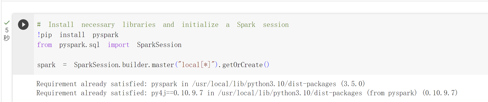
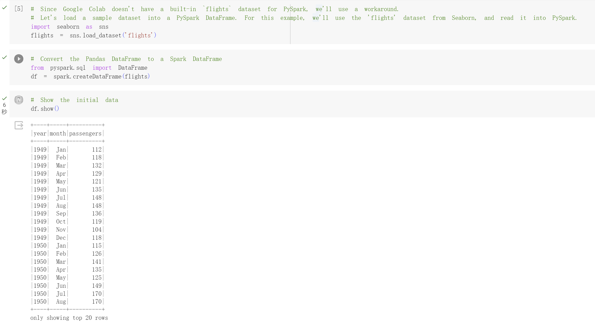
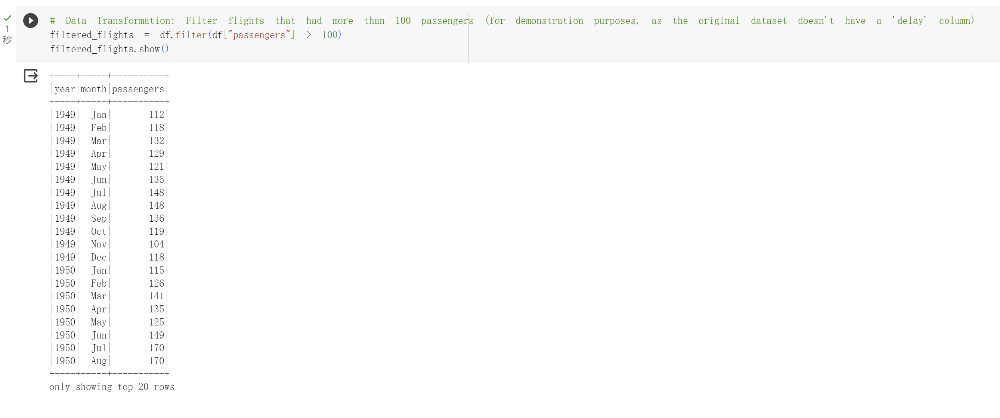
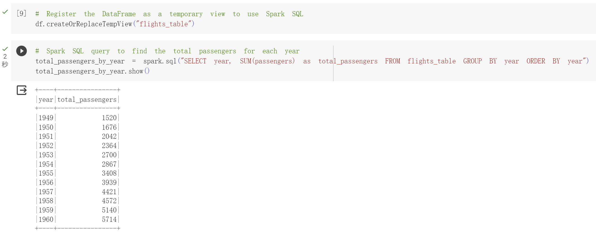

# IDS706_MiniProj10_YangXu

[](https://github.com/nogibjj/IDS706_MiniProj10_YangXu/actions/workflows/cicd.yml)

## Project Overview

This project showcases data processing using PySpark. The goal is to demonstrate proficiency in handling large datasets, performing Spark SQL queries, and applying data transformations. The project further integrates Continuous Integration and Continuous Deployment (CI/CD) pipelines to automate testing and formatting processes.

## Table of Contents

- [Project Structure](#project-structure)
- [Requirements](#requirements)
- [Setting Up](#setting-up)
- [Data Processing Explanation](#data-processing-explanation)
- [Sample Output](#sample-output)
- [Google Colab Version](#google-colab-version)

## Project Structure

```bash
IDS706_MiniProj10_YangXu (Root Directory)
│
├── .devcontainer
│ ├── Dockerfile
│ └── devcontainer.json
│
├── .github
│ └── workflows
│ └── cicd.yml
│
├── main.py
│
├── test_main.py
│
├── requirements.txt
│
├── Makefile
│
├── README.md
│
└── .gitignore
```

## Requirements

This project uses several libraries and tools which are listed in the `requirements.txt`. Notably:

- Basic utilities: `requests` and `pandas`.
- Data visualization: `matplotlib` and `seaborn`.
- Testing: `pytest`, `pytest-cov`, and `nbval`.
- Code formatting: `black`.
- Code linting: `pylint`.
- Database: `pymysql`, `psycopg2-binary`, and `python-dotenv`.
- Big data processing: pyspark.

## Setting Up

1. Clone this repository.
2. Install the necessary packages:
    ```bash
    pip install -r requirements.txt
    ```
3. Run the main script to execute the complex SQL queries:
    ```bash
    python main.py
    ```

## Data Processing Explanation

The PySpark data processing used in this project performs the following operations:

1.Loads the flights dataset into a DataFrame.
2.Filters the flights that had more than 100 passengers.
3.Executes a Spark SQL query to find the total number of passengers for each year.

## Sample Output
- Initial Flights Dataset:
A sample display of the flights dataset, showing the year, month, and passenger count.

- Filtered Flights:
A subset of the original dataset, only showing flights with more than 100 passengers.

- Total Passengers by Year:
A summary table showing the total number of passengers for each year.

- **Descriptive Statistics**:

    ```bash
    python3 main.py
    Setting default log level to "WARN".
    To adjust logging level use sc.setLogLevel(newLevel). For SparkR, use setLogLevel(newLevel).
    23/11/01 22:41:14 WARN NativeCodeLoader: Unable to load native-hadoop library for your platform... using builtin-java classes where applicable
    +----+-----+----------+
    |year|month|passengers|
    +----+-----+----------+
    |1949|  Jan|       112|
    |1949|  Feb|       118|
    |1949|  Mar|       132|
    |1949|  Apr|       129|
    |1949|  May|       121|
    |1949|  Jun|       135|
    |1949|  Jul|       148|
    |1949|  Aug|       148|
    |1949|  Sep|       136|
    |1949|  Oct|       119|
    |1949|  Nov|       104|
    |1949|  Dec|       118|
    |1950|  Jan|       115|
    |1950|  Feb|       126|
    |1950|  Mar|       141|
    |1950|  Apr|       135|
    |1950|  May|       125|
    |1950|  Jun|       149|
    |1950|  Jul|       170|
    |1950|  Aug|       170|
    +----+-----+----------+
    only showing top 20 rows

    +----+-----+----------+
    |year|month|passengers|
    +----+-----+----------+
    |1949|  Jan|       112|
    |1949|  Feb|       118|
    |1949|  Mar|       132|
    |1949|  Apr|       129|
    |1949|  May|       121|
    |1949|  Jun|       135|
    |1949|  Jul|       148|
    |1949|  Aug|       148|
    |1949|  Sep|       136|
    |1949|  Oct|       119|
    |1949|  Nov|       104|
    |1949|  Dec|       118|
    |1950|  Jan|       115|
    |1950|  Feb|       126|
    |1950|  Mar|       141|
    |1950|  Apr|       135|
    |1950|  May|       125|
    |1950|  Jun|       149|
    |1950|  Jul|       170|
    |1950|  Aug|       170|
    +----+-----+----------+
    only showing top 20 rows

    +----+----------------+
    |year|total_passengers|
    +----+----------------+
    |1949|            1520|
    |1950|            1676|
    |1951|            2042|
    |1952|            2364|
    |1953|            2700|
    |1954|            2867|
    |1955|            3408|
    |1956|            3939|
    |1957|            4421|
    |1958|            4572|
    |1959|            5140|
    |1960|            5714|
    +----+----------------+
    ```

## Google Colab Version

PySpark Data Processing in Google Colab<br>
In this project, the focus shifts from basic data manipulation tasks to the vast and powerful capabilities of PySpark. Working in a cloud-hosted environment on Google Colab, PySpark operations are leveraged to analyze and process a large dataset of flights. Essential tasks such as data transformations and Spark SQL operations stand at the forefront. The result of this exercise is a deeper understanding and appreciation of distributed data processing with Spark, all made possible through the convenience of cloud-hosted Jupyter notebooks.

### Requirements:

1. Use PySpark to perform data processing on a large dataset.
2. Include at least one Spark SQL query and one data transformation.

### Link to the Notebook:

[Google Colab Notebook](https://colab.research.google.com/drive/1Hdxqh0E6Ego9AHunBvS549ybLP6Wa498?usp=sharing)

### Project Implementation:

**Setup and Configuration:**
Initializing PySpark in Google Colab:<br>
Before any PySpark operations can be performed, the library needs to be installed and a Spark session must be initiated:
```bash
!pip install pyspark
from pyspark.sql import SparkSession

spark = SparkSession.builder.master("local[*]").getOrCreate()
```


**Data Loading and Exploration:**
Loading the `flights` dataset using Seaborn:<br>
As Google Colab does not offer a built-in `flights` dataset for PySpark, a workaround involves using Seaborn to access the dataset and then convert it to a Spark DataFrame:
```bash
import seaborn as sns
flights = sns.load_dataset('flights')
from pyspark.sql import DataFrame
df = spark.createDataFrame(flights)
df.show()
```


**Data Manipulation:**
Transformation:<br>
For our transformation task, we opted to filter the dataset based on the number of passengers. This helps identify flights with higher passenger counts:
```bash
filtered_flights = df.filter(df["passengers"] > 100)
filtered_flights.show()
```

<br>

Spark SQL:<br>
Spark SQL allows for the execution of SQL-like queries on our dataset, providing a familiar interface for data querying:
```bash
df.createOrReplaceTempView("flights_table")
total_passengers_by_year = spark.sql("SELECT year, SUM(passengers) as total_passengers FROM flights_table GROUP BY year ORDER BY year")
total_passengers_by_year.show()
```



In the code above, we first registered our DataFrame as a temporary SQL view. Then, an SQL query was executed to aggregate and sum the number of passengers for each year.

### Conclusion:
Utilizing the capabilities of PySpark in a cloud-hosted environment, this project exhibited how to process and analyze data on a larger scale. From setting up the environment to diving into transformations and SQL operations, the project offers insights into distributed data processing. Through this endeavor, the power and flexibility of PySpark as a tool for data professionals are evident.
